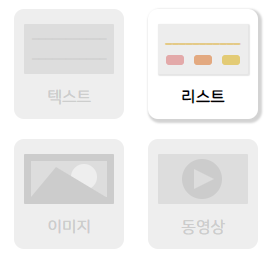

# 공모전 보고서

#### 작품명

```
스뮤고개
```

#### 작품소개

```
누구나 챗봇을 구축할수 있게끔 직관성과 유저 편의성에 중점을 둔 대학교에 특화된 챗봇 빌더입니다.
```

------

## 요약정보

#### 작품소개

```
＇스뮤소개＇는 대학교 내 단체들이 제공하고자 하는 정보들을 챗봇 형태로 누구나 구축하고 관리할 수 있는 웹 형태의 챗봇 빌더입니다. 챗봇 빌더 사용자들에게 직관적이고 사용자 친화적인 개발 툴을 제공하며, 대학교에서 자주 사용하는 챗봇 기능들을 템플릿 형태로 제공하여 누구나 쉽게 챗봇을 구축할 수 있다.
```

#### 작품구성도


#### 개발 배경 및 필요성

```
- 기존 챗봇 빌더의 낮은 접근성으로 인한 챗봇 구축 포기, 어려운 유지보수, 중단되는 인수인계
- 챗봇 빌더와 챗봇에 대한 인식 변화 필요
```

#### 작품 특 장점

````

````

#### 작품 기능

```
- 학교 메일을 통한 인증으로 로그인 및 회원가입을 하여 사용자 인증과 권한정보를 확인할 수 있다.
- 직관적인 시나리오 플로우차트로 자신이 속한 단체의 챗봇을 구축 할 수 있다.
- 사용자 친화적인 UX/UI로 템플릿을 이용할 수 있다.
- 창작마당을 통해 자신이 만든 챗봇 구조를 공유하고, 다른 사람이 만든 챗봇 구조를 사용할 수 있다.
- 챗봇 관리자마다 권한을 부여해 관리할 수 있는 챗봇의 영역을 제한할 수 있다.
- 같은 챗봇 관리자간에 메세지를 주고 받을 수 있다.
- 구축중인 챗봇을 미리보기 형태로 먼저 볼 수 있다.
```

#### 기대효과 및 활동분야

```
- 챗봇 빌더에 대한 진입 장벽을 감소, 접근성 증가
- 권한기능을 이용해 기존에 한 단체내에서도 여러개 있던 챗봇들을 없애고 하나의 챗봇으로 통합이 가능
- 원할한 유지보수와 인수인계
- 챗봇을 사용하는 사람들의 증가와 인식변화
- 챗봇 빌더 교육 매체로써의 활용
- 더 다양한 분야로 서비스 제공 가능성
```

------

## 개요
#### 1. 작품 소개

- 기획 의도

```
오늘날 수많은 단체에서 자기들만의 챗봇을 구축하는 모습을 볼 수 있다. 그러나 이러한 챗봇들이 그 개수에 비해 제대로 유지되는 경우가 적고 여전히 챗봇을 구축하는 것을 어려워하는 사람들이 많다. 
 이것은 대학교 내에서도 마찬가지였고, 이로 인해 해마다 같은 단체에서 새로운 챗봇을 만드는 경우나, 학교내에 챗봇의 개수가 너무 많아 내가 원하는 정보를 얻기 위해서 어떤 챗봇에 물어봐야 하는지 몰라 아예 사용하지 않는 경우들이 종종 보이곤 한다.
그래서 이러한 문제점을 해소해보자는 아이디어를 기점으로 프로젝트 주제를 정했다.
```
- 작품 내용

```
'스뮤고개'는 대학교 단체내에서 챗봇을 구축하고 싶거나, 기존에 구축한 챗봇의 관리에 어려움을 가지고 있는 사람들을 위해 개발된, 사용자 친화적인 대학교 챗봇 구축에 특화된 챗봇 빌더이다.
이 챗봇빌더를 이용하면 직관적인 인터페이스로 개발 지식이 없더라도 쉽게 익숙해지고 간편히 챗봇을 관리할 수 있다.
그리고 대학교에 특화된 챗봇 빌더인 만큼 자체적으로 대학교 챗봇 구축에서 많이 사용되는 양식을 자체적으로 제공하고, 다른 사람들이 만든 템플릿 구조를 창작마당을 통해 공유할 수 있다. 이렇게 제작된 챗봇의 모습은 미리보기의 형태로 실제 챗봇에서 어떻게 보여지는지 확인할 수도 있다.
또한, 한 챗봇 빌더를 관리하는 사람들은 각자에게 부여된 권한을 통해 챗봇 플로우차트에서 접근할 수 있는 영역이 제한될수 있기에 챗봇이 통합되어 관리될 수 있다.
```


#### 2. 작품의 개발 배경 및 필요성

```
  기존에는 대부분의 학교 정보를 얻기 위해서는 홈페이지에 들어가서 정보를 검색하거나, 학교에 직접 전화를 해서 정보를 얻어야 하는 불편함이 있었다. 그러한 불편함을 해결하기 위해 학교나 학생들이 챗봇을 자체적으로 만들기도 하지만, 챗봇을 만들더라도 한 학교 내에서도 단체별로 서로 다른 챗봇을 구축하고 있고 이러한 챗봇마저 해마다 바뀌는 관리자로 인해 인수인계가 제대로 되지 않는 등의 문제점이 있어 챗봇 사용자들은 최신화된 정보를 얻기 힘들었다. 결국 사용자들은 자신이 원하는 정보를 얻기 위해서 어떤 단체의 챗봇에 들어가 봐야 되는지 모르고, 챗봇을 사용해도 정보의 최신화가 이루어지지 않아 결국 시간 낭비를 하고 마는 경우가 발생해 대부분의 학생이 학교 챗봇을 사용하지 않는 상황이 발생했다. 따라서 챗봇을 제작하기 쉬워 누구나 참여할 수 있고, 정보를 통합하여 획일화된 정보를 제공하며, 유지보수가 간편한 챗봇 빌더가 필요했다.
```


#### 3. 작품의 특징 및 장점

```

```


------

## 구성도 및 기능

#### 1. 작품 구성도

- 전체적 구성도

  

```
- 챗봇빌더 사용자가 웹 형태로 제공되는 챗봇 빌더를 통해 챗봇을 구축한다.
- 챗봇을 DB에서 불러오면 DB내 정보들이 HTML코드 형태로 변환되어 관리자에게 보여진다.
- 구축된 챗봇과 파일들은 저장버튼을 통해 DB에 변환되어 저장된다.
- DB에서 새롭게 형태가 변화되면 지정된 플랫폼에서 제공하는 챗봇 형태로 변환되어 업데이트 된다.
- 플랫폼에서 제공되는 챗봇이 업데이트 되면 챗봇 사용자들은 업데이트된 챗봇을 사용할 수 있다.
```

- 메뉴 구성도


#### 2. 작품 기능
2-1. 전체 기능 목록

| 구분 |         기능          |                             설명                             | 진척도(%) |
| :--: | :-------------------: | :----------------------------------------------------------: | :-------: |
| S/W  |  회원가입 및 로그인   | 학교 메일을 통한 인증으로 회원가입과 로그인이 가능하다. (9월30일) |    80%    |
|      |       챗봇 생성       |         원하는 챗봇을 생성할 수 있는 기능(10월 15일)         |    30%    |
|      | 회원정보 수정 및 탈퇴 |  자신의 개인정보를 수정하거나 탈퇴할 수있는 기능(9월 30일)   |    80%    |
|      |       1:1 문의        |         개발자와 1:1 문의 할 수 있는 기능(9월 30일)          |    80%    |
|      |       목록 검색       | 자신이 원하는 학교의 챗봇 빌더를 검색할 수 있는 기능(9월 30일) |    80%    |
|      |  챗봇 시나리오 제작   | 시나리오를 플로우 차트 형태로 만들어 챗봇의 구조를 이해하기 쉽게 구출할 수 있는 기능 |   100%    |
|      |       챗봇 저장       |        구축한 챗봇을 저장해 챗봇 형태로 변환되는 기능        |   100%    |
|      |     챗봇 불러오기     | 저장되있는 챗봇 구조를 불러와 이어서 구축할 수 있는 기능(9월 30일) |    80%    |
|      |      템플릿 선택      | 기본 ,고급 템플릿을 자체적으로 제공해 직관적으로 챗봇을 구축할 수 있는 기능(9월 30일) |    90%    |
|      |       창작마당        | 자신이 만든 챗봇 구조를 공유하고, 다른사람이 만든 구조를 다운로드 할 수 있는 기능(10월 15일) |    30%    |
|      |        메세지         | 같은 챗봇 빌더를 관리하는 사람들간에 메세지를 주고 받을 수 있는 기능(10월 15일) |    30%    |


2-2 S/W 주요 기능

|        기능        |                             설명                             | 작품실물사진 |
| :----------------: | :----------------------------------------------------------: | :----------: |
| 로그인 및 회원가입 |          인증을 위한 로그인 및 회원가입이 가능하다.          |              |
|   챗봇 목록 검색   | 검색을 통해 원하는 챗봇을 찾거나, 유사한 챗봇이 있는지 확인할 수 있다. |              |
| 챗봇 시나리오 제작 | 챗봇 시나리오를 플로우차트 형태로 만들어 시각적으로 보기 쉽게 제작할 수 있다. |              |
|    템플릿 선택     | 기본 및 고급 템플릿을 자체적으로 제공하여 직관적으로 챗봇을 구축해나갈 수 있다. |              |
|     챗봇 저장      | 제작중인 챗봇을 자동으로 저장을 해 두어 다음 실행 시 이어서 제작할 수 있다. |              |
|      창작마당      |    사람들간에 자체적으로 만든 챗봇 구조를 공유할 수 있다.    |              |
|       메세지       | 같은 챗봇 빌더를 사용하는 사람들간에 메세지를 주고 받을 수 있다. |              |
|      1:1 문의      |      챗봇 빌더를 사용하면서 생기는 질문들을 할 수 있다.      |    이미지    |

-------

## 적용기술

#### 주요 적용 기술

- animate UI

  : 사용자들이 챗봇을 구축하면서 사용하는 템플릿들을 hover시 움직이는 효과를 주어, 인지하기 쉬운 형태로 표현한다.

  

  [그림] 작품내 리스트를 선택했을때의 모습과 이에 해당되는 animate UI 코드의 일부 모습


- 동적 웹 레이아웃

  : 챗봇 빌더 레이아웃을, 사용자 취향에 맞게 일부 조절 가능하다.

  

   [ # 속성 및 미리보기 레이아웃을 접어주는 동적 웹 프로그래밍 코드 일부]


```
(생략) - 이미지 너무 많아서 바로 공모전 양식 수정 함

- 준영 이부분 보면 너 파트 수정할꺼 적어놨으니 수정하고 너가 양식에 올리지 말고 나한테 보내줘
```
------


## 문제 및 해결방안

#### 1. 프로젝트 관리 측면

  - 이번과 같은 장기 프로젝트가 처음이였던 만큼 프로젝트 진행을 관리하는데 있어 많은 불안함이 있었습니다. 하지만 한이음이라는 단체에서 프로젝트를 진행하면서 어려운 부분이 있으면 자문을 구할 수 있는 멘토님이 계셨고, 프로젝트를 진행해나가며 알아야되는 것들을 한이음 데이를 통해 알게되었습니다. 그리고 팀장으로써 요구했던 부분을 훌륭히 수행해줬던 같은 멘티들이 있어서 프로젝트가 잘 진행되었습니다. 하지만 작품을 구축하며 생각보다 적은 정보 및 오픈소스들로 인해 많은 시간이 소비되어 생각보다 프로젝트 구현부분에 많은 시간을 소모하게 되었습니다. 이에 같은 멘티들과 많은 논의를 하였고, 선택과 집중을 통해 프로젝트를 구현해 정상 궤도로 돌아오게 되었습니다.


#### 2. 작품 개발 측면

```
- 작품이 챗봇 빌더인 만큼 기존의 챗봇을 구축하는것 보다 어려움이 있었고, 무엇보다 챗봇 빌더 자체가 해외에서도 그다지 공개되지 않은 분야이며 국내에서도 이제야 대기업들이 서비스를 제공하는 추세다보니 관련 오픈소스는 거의 전무했고, 필요한 기능을 구현하기 위한 코드들 조차 양이 많지 않아 프로젝트 구현 내내 어려움이 있었다. 그래도 챗봇 빌더의 기본 구조를 위한 라이브러리 "jsplumb"을 찾아 이를 기반으로 프로젝트를 구현하는데 성공했습니다.

- 처음에 챗봇빌더의 화면의 정보를 바로 python 코드로 변환해 챗봇에 적용시키려 했으나, 이로 인해 생길수 있는 보안문제 및 권한문제가 많아 중간에 DB를 사용해주어 구축하는데 시간이 걸렸지만 보안 측면에서 더욱 안정성을 띄웠습니다.

- 플로우차트내에 생성된 템플릿의 크기가 변하면 연결점의 위치가 제멋대로인 현상이 발생했습니다.이를 크기가 변할때마다 jqeury를 이용하여 크기가 변하는 이벤트가 발생될때마다 repaint함수를 이용해 문제를 해결했습니다.

- 자바스크립트에 있는 정보를 DB로 사용한 node로 옮기는데 어려움이 있었습니다. 기존에 구상했던 방식대로 HTML를 넘겨주는 방식이면 form 형태로 데이터를 전송해주면 되지만, 개선된 방법은 Javascript를 이용해 정보를 넘겨줘야 했습니다. 여러 해결방법을 모색한 결과 ajax라는 중간 변환 기능을 이용해 json방식으로 post해준 후, node에서 DB로 데이터를 넘겨주는 방식으로 이를 해결했습니다.
```


------

## 느낀점 및 기타사항

#### 1. 느낀점

생략(수정할꺼 없음)


#### 2. 본문에서 표현되지 못한 작품의 가치(Value) 및 제작 노력

- ＇챗봇 빌더＇에 대한 소스코드는 구할 수 없었기에 웹에서 정보를 받아 DB에 저장한 후, 텔레그램 챗봇 api를 이용해 챗봇을 개발하는 알고리즘을 직접 구현했습니다. 이로서 챗봇 빌더 사용자는 웹을 통해 챗봇 빌더를 쉽게 개발할 수 있습니다.
- 현재 시중에 나와있는 챗봇 빌더 같이 웹에서 챗봇을 개발한다는 점은 유사했지만, 학생들에게 특화된 챗봇 빌더를 구현하기 위해 사용자에게 기본적인 틀을 제공한다는 점, 창작 마당을 통해 다른 학생이 만들었던 ＇템플릿＇을 참고할 수 있다는 점에서 차이점이 보였습니다.
- 챗봇 제작하는데 있어 시나리오들 간의 관계를 직관적으로 표현하기 위해 플로우차트(flow-chart) 형태로 구현하였습니다. jsplumb라이브러리를 사용하여 연결관계를 표현하였고 템플릿을 동적으로 생성하여 입력값과 좌표값을 서버로 보내어 의미있는 데이터로 만들고 그 데이터를 다시 불러와 플로우차트를 다시 구현하는 기능을 구현하였습니다.


#### 3. Git repository [한이음만 해당]
  https://lab.hanium.or.kr/smugoge/smuhill (https://github.com/Hanswind/smuhill)

------

## 기대효과

#### 1. 작품의 기대효과

**(제가 개요에 쓴 기대효과부분 한번 읽어보시고 자세히 써주세요!!)**

```

○ 챗봇빌더 자체가 국내외적으로 크게 발전한 시작이 아니며 이 프로젝트와 같이 특정 단체에 특화된 챗봇 빌더는 없기에 수많은 해당 단체의 수요를 만족할 수 있다.

○ 대부분의 챗봇빌더는 인텐트와 자연어 처리에 대한 이해가 필요하며 메시지 플랫폼과 연동과정에서 코딩이 필요하므로 일반인들이 접근하기에 쉽지 않다.

○또한 이들은 플로우차트를 이용한다는 점에서 우리 프로젝트와 유사하지만  챗봇 빌더의 UI를 해당 챗봇 플랫폼에 제공하는 형태와 유사하게 구현한 점에 있어서 보다 직관적이라, 사용자의 이해를 돕는다.

○특정 사용자들에게만 챗봇을 일부 영역관리할 수 있는 권한을 부여할 수 있어, 여러명이 한 챗봇을 구축한다해도 보안의 위협을 낮출 수 있다.
```

#### 2. 작품의 활용분야

```
○ 챗봇빌더에 대한 접근성 향상 : 챗봇빌더가 낯선 사람들의 챗봇 구축에 대한 진입 장벽을 낮춰줘, 사람들의 인식을 변화시킬 수 있다. 이는 자신이 속한 학교의 챗봇제작에 참여하여 언제든지 수정,관리 할 수 있다는 뜻이다.

○ 정보의 다양화와 활용 : 보다 많은 학생들이 참여하게 되면 직접 찾아보지 않으면 알기 어려웠던 세세하고  많은 정보들을 담을 수 있게 되고 모이고 모여 빅데이터를 이루게 된다. 이 빅데이터는 학교를 대표하는 데이터가 될 수 있고 여러 방면으로 활용이 가능하다.

○ 분야의 확장 : 챗봇빌더를 캠퍼스뿐만 아니라 기업, 병원 등 단체에서도 사용할 수 있다. 정보가 통합되어 관리되고 최신 정보를 바로 업데이트 할 수 있기 때문에 획일성과 최신성을 갖출 수 있다. 이는 기업,단체에 속한 직원들간의 정보 공유를 활성화 시킨다.

○ 개인정보 열람 :   학사정보와 같이 개인정보에 대한 데이터베이스에 접근이 가능해지면 학생들은 학사정보 홈페이지에 접속하지 않고 챗봇으로 자신의 개인정보를 열람할 수 있다.

○ 교육 매체로 활용 : 챗봇을 만드는데 관심이 있는 사람은 누구나 손쉽게 만들 수 있기 때문에 입문용으로 쳇봇의 원리를 간단히 이해하는데 매우 효과적이다.
```

------

## 개발 산출물

 파워포인트 파일에다가 작성해주세요