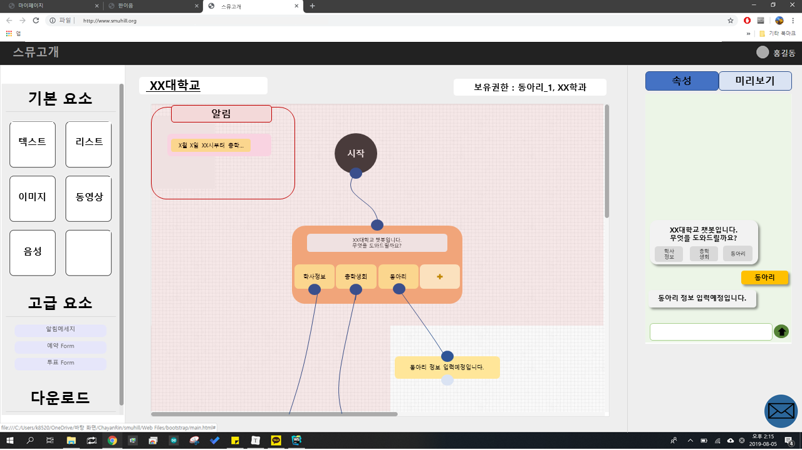

# 중간보고서

### 1. 프로젝트 개요

- **프로젝트 소개**
  
  ```
  본 프로젝트를 통해 기존에 학교 홈페이지와 같은 매체를 통해서만 알 수 있는 학사정보나 
  총학생회, 동아리와 같은 여러 학교 단체들이 정보들을 제공하는 챗봇을 비전공자라도 
  쉽게 만들고 관리 할 수 있고 이를 통해 학생들이 더욱 쉽게 정보들을 접할 수 있게 해주는 
  ‘캠퍼스 챗봇 빌더(이하 스뮤힐)’ 개발하고자 한다.
  
  '스뮤힐'을 이용해 챗봇을 개발하고자 하는 단체들은 직관적이고 유저 친화적인 개발 툴을 이용해 
  관련 개발지식이 없더라도 쉽게 챗봇을 생성하고 유지보수 할 수 있다. 
  캠퍼스 챗봇에 특화된 만큼 챗봇 빌더에서 자체적으로 제공되는 많이 사용하는 폼(form)을 
  기본적으로 템플릿(Template) 형태로 제공하고, 사람들이 만든 커스텀 폼, 템플릿을 
  '창작마당'이라는 매체를 통해 공유할 수 있다. 
  
  또한 사용자마다 '권한'기능을 부여해, 
  하나의 통합된 챗봇이라해도 챗봇 빌더를 사용하는 사람마다 
  접근할 수 있는 영역을 지정할 수 있다.
  
  '스뮤힐'을 이용해 개발된 챗봇은 기존에 단체마다 여러 개로 나뉘어있던 챗봇으로 인해 
  헷갈려하던 사람들에게 하나의 통합된 챗봇으로 제공되고, 
  쉬운 유지보수로 관리 할 수 있는 만큼 사용자들은 접근성이 높은 카카오톡, 페이스북 메시지와 같은 
  메시징 플랫폼을 통해 원하는 정보를 쉽게 얻을 수 있다.
  ```
  
- **추진배경 및 필요성**

  ```
  기존에는 대부분의 학교 정보를 얻기 위해서는 홈페이지에 들어가서 정보를 검색하거나, 
  학교에 직접 전화를 해서 정보를 얻어야 하는 불편함이 있었다.
  
  그러한 불편함을 해결하기 위해 학교나 학생들이 챗봇을 자체적으로 만들기도 하지만, 
  챗봇을 만들더라도 한 학교 내에서도 단체별로 서로 다른 챗봇을 구축하고 있고 
  이러한 챗봇마저 해마다 바뀌는 관리자로 인해 인수인계가 제대로 되지 않는 등의 문제점이 있어
  챗봇 사용자들은 최신화된 정보를 얻기 힘들었다.
  
  결국 사용자들은 자신이 원하는 정보를 얻기 위해서 어떤 단체의 챗봇에 들어가 봐야 되는지 모르고, 
  챗봇을 사용해도 정보의 최신화가 이루어지지 않아 결국 시간 낭비를 하고 마는 경우가 발생해 
  대부분의 학생이 학교 챗봇을 사용하지 않는 상황이 발생했다.
  
  그러한 부분에서 '스뮤힐'은 위와 같은 불편함을 해결할 수 있다. 
  
  먼저 '스뮤힐'은 하나의 챗봇 빌더를 통해 통합된 챗봇을 제공하여 
  사용자가 한 개의 챗봇을 통해 정보를 얻을 수 있다. 
  통합된 챗봇 빌더를 관리하기 위해 각자의 영역과 권환이 부여되어있다.
  예를 들어 총학생회는 총학생회 영역의 정보들만 관리할 수 있고, 
  동아리 영역의 정보들은 각 동아리 관리자만 접근할 수 있게 되어있다.
  
  또한 각자 영역의 챗봇 관리자가 챗봇을 전혀 모르는 사람이더라도 
  미리 제공되는 템플릿(Template)을 통해 정보만 추가하면 되기에 누구나 챗봇을 관리할 수 있다.
  이러한 기능을 통해 챗봇을 만들게 된다면 챗봇 사용자는 정보를 쉽게 얻을 수 있고, 
  챗봇 빌더 관리자는 챗봇의 관리가 쉬워 정보들을 쉽게 최신화 및 유지보수 할 수 있게 된다.
  ```

- **국내, 외 기술 현황**

  ```
  국내에서 챗봇 빌더는 카카오, 네이버, LG CNS와 같은 대형 IT 서비스 기업에서 
  '카카오 i 오픈빌더', 'danbee.AI'와 같은 챗봇 빌더를 제공하기 시작했고, 
  '봇그리다'와 같은 챗봇빌더 프레임워크들이 서비스 시작하는 등의 
  챗봇 빌더에 대한 인식을 넓히기 시작했다.
  
  해외에서는 이미 'Chatfuel', 'Dialogflow', 'ManyChat' 와 같은 수많은 챗봇빌더를 제공하고 있고, 
  이 챗봇빌더들은 대부분 페이스북 메세지 챗봇빌더의 기능을 제공하고 있다.
  
  우리는 이미 존재하는 국내외 챗봇 빌더와 차별성을 두기 위해 
  '캠퍼스'라는 특정 사회 그룹에 전문성을 두었고, 
  이를 템플릿이라는 형태와 관리를 위한 권한 기능을 중점적으로 구현하고자 한다.
  ```

- **개발 목표 및 내용**

  **1) 최종개발 목표**

  ```
  보통 주변에서 챗봇에 대해 이야기해 보면, 몇번이라도 챗봇을 사용해본 사람들은 많았다.
  하지만, 그중 대부분이 수많은 불편함 때문에 챗봇에 대한 사용 만족도가 낮았고, 
  사용하더라도 불가피한 상황일 때나 사용하고들 한다.
  거기에 챗봇을 제작해보거나 챗봇빌더라는 것에 대해 이야기해 보면,
  비전공자들은 챗봇빌더라는 용어 자체를 모르는 경우가 많았고, 전공자라 하더라도
  막연히 챗봇을 만드는 것이 어려울 것이라는 생각 때문에 쉽게 시도하지 않았다.
  
  이러한 점에서 '스뮤힐'의 궁극적인 목표는 
  '스뮤힐'을 통해 누구나 쉽게 챗봇을 만들고 관리할 수 있게 하고,
  챗봇과 챗봇빌더에 대한 접근성을 높이고자 하는 것이다.
  
  이를 위해 '템플릿', '유저 친화적 인터페이스', '유저별 권한 기능', '창작마당'등 과 같은 
  핵심 기술들을 개발하는 것이 우리의 주목표다.
  이후 유지보수와 안정성을 가지게 되면 '캠퍼스'라는 한정된 그룹의 범위를 넓혀 
  더 많은 단체가 챗봇 빌더를 사용할 수 있게 하고자 한다.
  ```

  **2) 주요 개발내용(기능중심)**
  ```
  1. 템플릿을 제공하여 유저는 간단한 입력만으로 챗봇의 시나리오를 작성할 수 있다.
  2. 드래그 가능한 플로우차트 형식으로 만들 수 있어 유저 친화적인 인터페이스를 제공한다.
  3. 유저별로 권한을 다르게 부여하여 관여할 수 있는 부분을 다르게 할 수 있다.
  4. 미리보기 기능을 제공하여 챗봇을 제작하는 도중에도 테스트해 볼 수 있다.
  5. 유저들이 스스로 만든 템플릿을 창작마당을 통해 공유할 수 있도록 한다.
  ```

  **3) 기존 기술 활용여부 및 차별성**

  ```
  이미 해외에는 수많은 챗봇 빌더들이 존재하고, 국내에도 챗봇 빌더가 점점 생겨나고 있지만 
  이러한 것들 대부분 아직은 약간의 코딩과 API에 대한 지식이 필요해 접근성이 비교적 낮은 편이다. 
  이러한 점에서 '스뮤힐'은 유저 친화적 인터페이스와 템플릿을 이용해 
  비전공자라 해도 누구나 챗봇 빌더를 간편히 만들 수 있다는 인식을 주어 
  챗봇 빌더에 대한 접근성을 높이고자 한다.
  
  또한 캠퍼스라는 특정 그룹에 전문성을 두어 관련 템플릿 등을 추가하여 
  기존에 캠퍼스라는 단체내 챗봇 빌더 구축에서 발생하던 
  개발자 부재, 인수인계, 어려운 유지보수 등과 같은 수많은 문제점을 해소하고자 한다. 
  
  그리고 '스뮤힐'은 사용자별로 권한을 달리 적용할 수 있다. 
  이로써 여러 명이 작업을 할 때 자신의 권한을 넘어서는 부분을 무단으로 변경, 삭제하는 것을 방지하며 
  작업 중인 부분을 다른 사람이 접근하지 못하게 블록 처리하여 작업에 혼동이 발생하지 않게 해준다.
  
  이를 이용하면 기존에 학교 내 단체별로 있던 수많은 챗봇들을 하나의 챗봇으로 통합관리가 가능하여 
  챗봇 사용자들의 혼동을 감소시킬 수 있다.
  ```

- **구성도**

  ```

  ```

  <br>

  -----

### 2. 프로젝트 내용

* **주요기능 및 설명**

  ```
  '스뮤힐'의 주요기능은 크게 3가지로 챗봇 구축 기능, 권한 기능, 템플릿 기능이 있다.
  
  첫 번째로 챗봇 구축 기능은 챗봇을 구현할 수 있는 챗봇 빌더의 플랫폼을 
  보다 직관적으로 이해하고 사용할 수 있게끔, 
  유저 편의성 인터페이스에 중점을 두고 구현하고자 하는 기능이다.
  
  두 번째로 권한 기능은 특정 챗봇에 마스터 권한을 가지고 있는 사람이 
  해당 챗봇을 수정이나 관리를 하는 사람마다 영역별로 권한을 부여해 
  권한이 부여된 영역 내에서만 챗봇을 수정이나 관리를 할 수 있는 기능이다.
  
  마지막으로 템플릿 기능은 '스뮤힐' 챗봇빌더가 캠퍼스 챗봇 빌더라는 
  특정 분야에 전문성을 가지는 만큼, 
  해당 단체에서 주로 구현하고 사용하는 특정 기능들을 
  템플릿 형태로 미리 구현해 폼(form)형태로 
  사용자에게 제공해 더욱 쉽게 챗봇을 구축할 수 있게 하는 기능이다.
  ```

* **적용기술**

  ```
  '스뮤힐' 챗봇 빌더는 웹 형태로 사용자에게 제공되기에, 
  웹 페이지(프론트엔드)를 구현하기 위한 HTML, CSS, JS와 같은 기술들이 사용되었고
  사용자 계정정보 및 구현중인 챗봇 빌더의 형태를 저장하고 불러오는 등의 벡엔드 및 DB를 구현하기 위해
  Node.js, ERS, AWS 서버와 같은 기술을 사용했다.
  그리고 svg 태그 내에 챗봇 빌더의 flowchart를 구현하기 위해서 jsPlumb 라이브러리를 사용했다.
  ```

* **예상 결과물**

  

  <br>

  -----

### 3. 프로젝트 수행일정

* **계획**

  ```
    시작 월:3월 종료 월: 4월
    1. 프로젝트 팀 구성 및 아이디어 구상 
    2. 프로젝트 계획서 작성 및 아이디어 구체화
    3. 프로젝트 수행 모임 시간/장소 계획
  ```
  
* **분석**

  ```
    시작 월:3월 종료 월: 4월
    1. 챗봇 빌더 및 챗봇 시장 분석(벤치마킹) 
    2. 상용화된 기존 챗봇 빌더와 장단점 분석
  ```
  
* **설계**

  ```
    시작 월:5월 종료 월: 6월
    1. 챗봇 빌더 프레임 설계
    2. 상세기능정의, 구현모델/구조/기능 설계
    3. DB설계, 프로세스설계 및 기술 검토
  ```
  
* **개발**

  ```
    시작 월: 7월 종료 월: 9월
    1. S3, EC2 구축 
    2. 파이썬을 통한 텔레그램 챗봇 플랫폼 분석 및 템플릿 개발
    3. 챗봇 플랫폼 제공을 위한 웹페이지 구축
    4. AWS를 이용해 DB 구축
  ```

* **테스트**

  ```
    시작 월: 9월 종료 월: 10월
    1. 테스트 시나리오 작성 
    2. 단위테스트 및 디버깅, 통합테스트
  ```

* **종료**

  ```
    시작 월: 11월 종료 월: 11월
    1. 한이음공모전, 최종 결과보고서 작성
  ```

-----

### 4. 기대효과 및 개선사항

* **기대효과**

  ```
  '스뮤힐'을 통해 챗봇을 만드는 사람들은 직관적인 인터페이스와 기능들로 관련 전문지식이 없더라도 
  쉽게 챗봇을 구축할 수 있고, 기존에 여러개로 나뉘어 있던 챗봇들을 하나로 통합해 관리가 가능하다.
  
  이와 같은 쉬운 구축 방법과 용이한 관리방법으로 인해 챗봇을 유지보수하기가 쉬어, 
  챗봇을 통한 정보 최신화 유지 뿐만 아니라 사용자가 원하는 기능 구현이 가능하다.
  
  그리고 위와 같이 챗봇이 잘 구축되고 유지되면, 이를 사용하는 사용자들도 
  챗봇을 통해 자신들이 원하는 정보에 대한 접근성이 높아져
  이를 사용하는 사용자들의 수도 증가할 것이다.
  ```

* **개선사항**

  ```
  아직은 핵심 기능들 중점으로 개발하고 있기에, 핵심 기능들을 구현하고 나면 
  유지 친화적 인터페이스를 위해 기능을 더욱 간편화 하고, 디자인에 중점을 두고자 한다.
  
  또한 핵심 기능들도 최적화 기능을 지속적으로 거치면서, 
  '스뮤힐'을 이용하고자 하는 사람들이 불편함이 없게 하고자 한다.
  ```

* **문제점 및 애로사항**

  ```
  핵심 기술중 하나인 javascript를 통해 챗봇 구조를 시각적으로 표현하는데 조금 어려움을 겪고 있지만, 조금씩 해결해나가고 있다.
  ```

* **요청사항**

  ```
  
  ```

  

